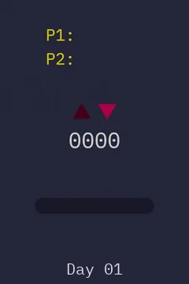
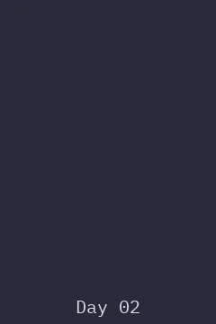
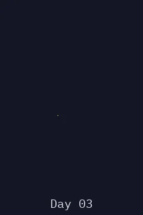
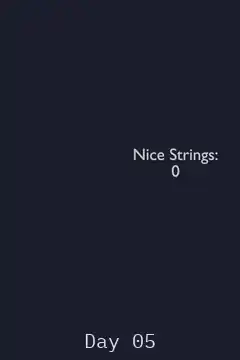
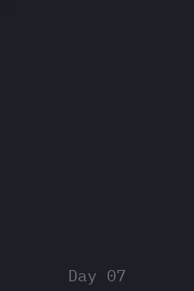
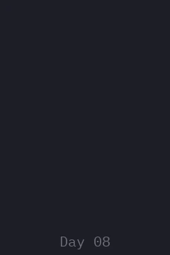
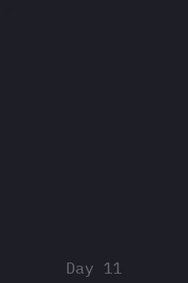

# Advent of Code 2015 · Geometry Nodes

Solutions to [Advent of Code 2015](https://adventofcode.com/2015) built with Blender Geometry Nodes.

## Days

  
  
  
  
  
  
  
  
  
  
  
  
  
  
  
  
  
  
  
  
  
  
  
  
  

## How to use

1. Open a day's `.blend` file in Blender 5.2. If a day needs a different Blender version, it is stated in that day's README.
2. Paste your own puzzle input into the String node labelled "Puzzle Input", somewhere in the node tree. It accepts multi-line text.
3. The answers may appear somewhere in the viewer, the viewport, or as a visual representation that can be seen by playing the animation.

## Puzzles

The puzzle text and inputs are not included: the [Advent of Code FAQ](https://adventofcode.com/2015/about) asks not to copy them. Read each puzzle on [adventofcode.com](https://adventofcode.com/2015). Each day's README only has a short summary in my own words.

## AI use

I use AI for administrative work, such as repository setup and git changes. The Blender files and the Geometry Nodes inside them are made by hand. I sometimes use AI to brainstorm ideas or when I am stuck on how to approach a problem.
