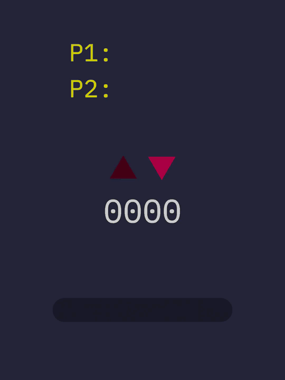
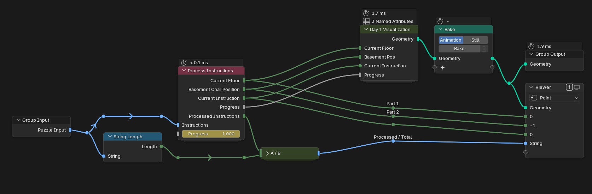
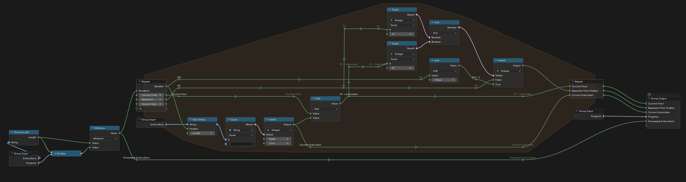
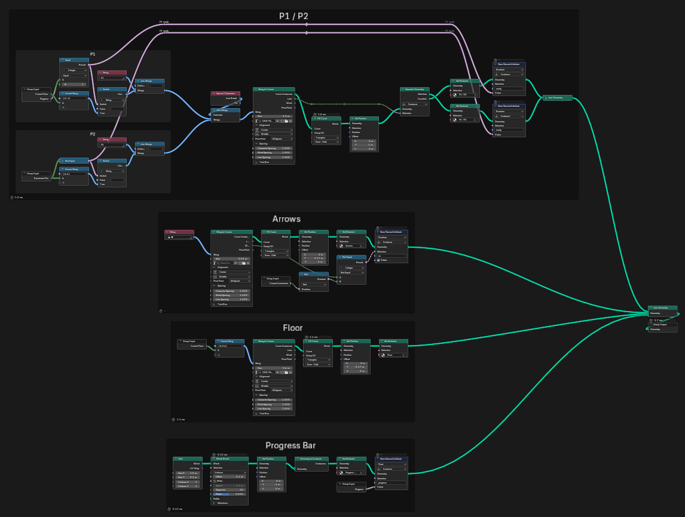
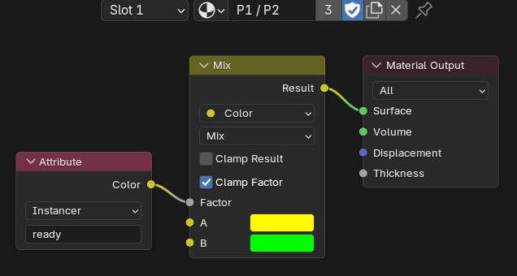
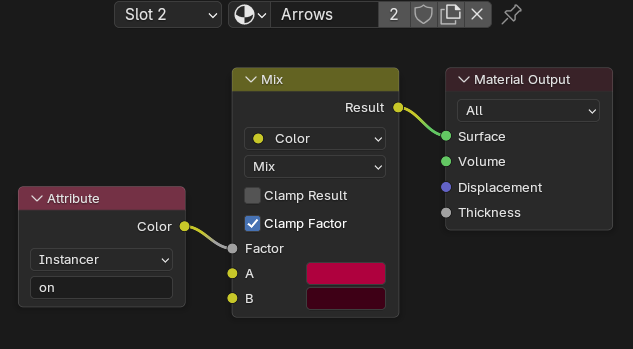
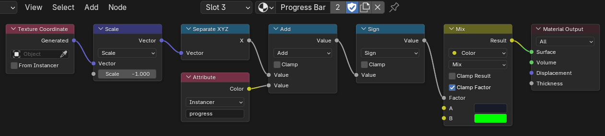
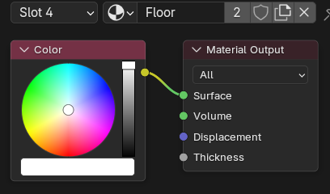

# Day 1: Not Quite Lisp

https://adventofcode.com/2015/day/1

I was not sure how to represent this problem visually, so I made a panel like an elevator display. Each part fills in once its value is known.

  

Font: IBM Plex Mono, used under the SIL Open Font License 1.1 ([license](IBMPlexMono-LICENSE.txt)).

## Solution

The main tree reads the instructions, runs them and sends the result to the visualization.

The Process Instructions group walks through the string one character at a time.

## Visualization

### Materials

