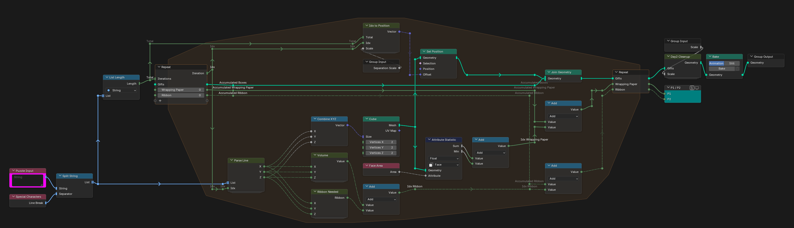
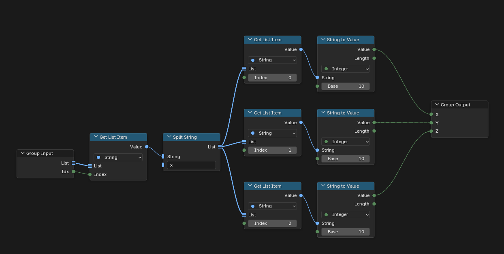
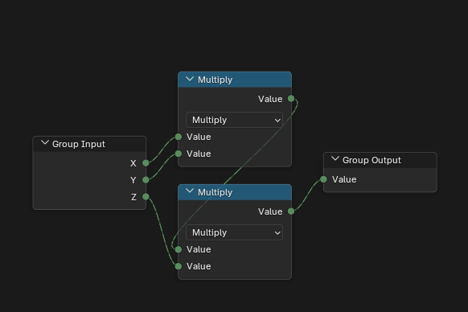
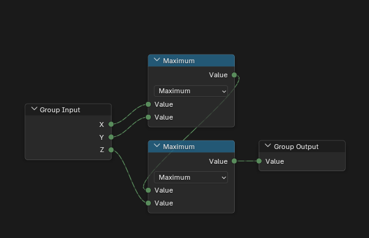
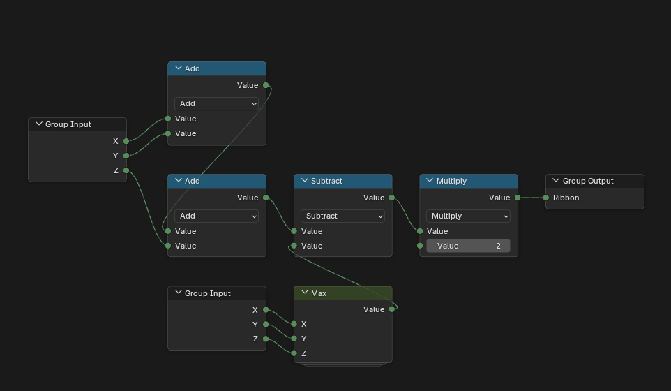
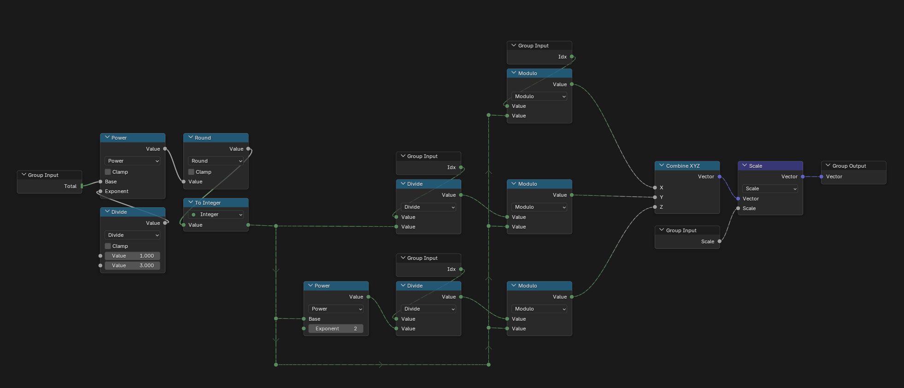
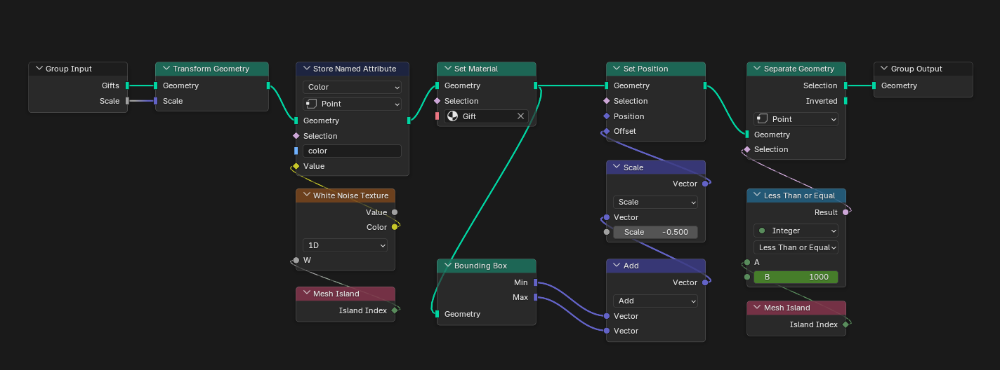
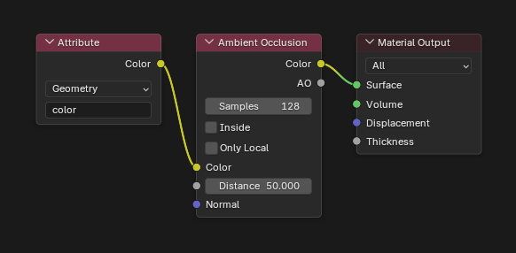
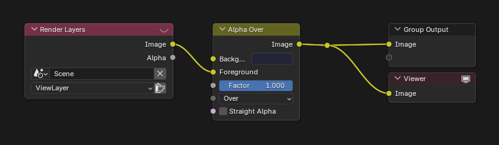

# Day 2: I Was Told There Would Be No Math

https://adventofcode.com/2015/day/2

**Part 1:** each line gives the dimensions of a box; add up the wrapping paper, which is each box's surface area plus the area of its smallest side.

**Part 2:** add up the ribbon, which is each box's smallest perimeter plus its volume.

Blender can measure geometry, so I made a cube for each present and used things like the face area of each cube to get the answers, making the most of what a 3D program already does.

  

## Solution

The main tree splits the input into lines and builds one cube per present in a repeat zone. The wrapping paper comes from an Attribute Statistic over the face areas of each cube: their sum plus the smallest one. The ribbon adds Ribbon Needed and Volume.

Parse Line turns a line like `2x3x4` into its three dimensions.

Volume multiplies the three dimensions.

Max returns the largest dimension.

Ribbon Needed returns the smallest perimeter of a present.

## Visualization

Every box appears as it is generated, on a 10x10x10 grid, each with a random color.

Idx to Position turns the index of a present into its place on the grid; the grid size is the cube root of the number of presents.

Day2 Cleanup scales the presents, gives each one a random color and centers the result.

## Materials

### Gift

The Gift material reads that random color and darkens it with ambient occlusion.

## Compositor

