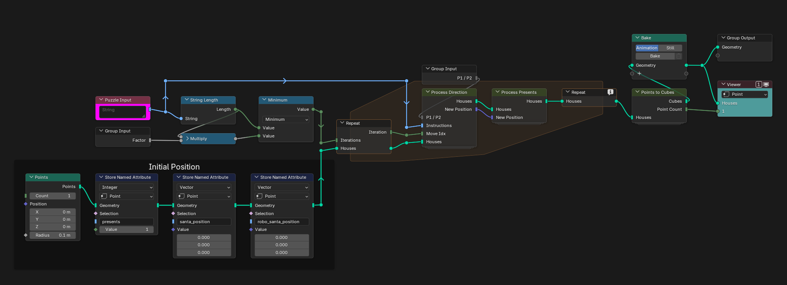
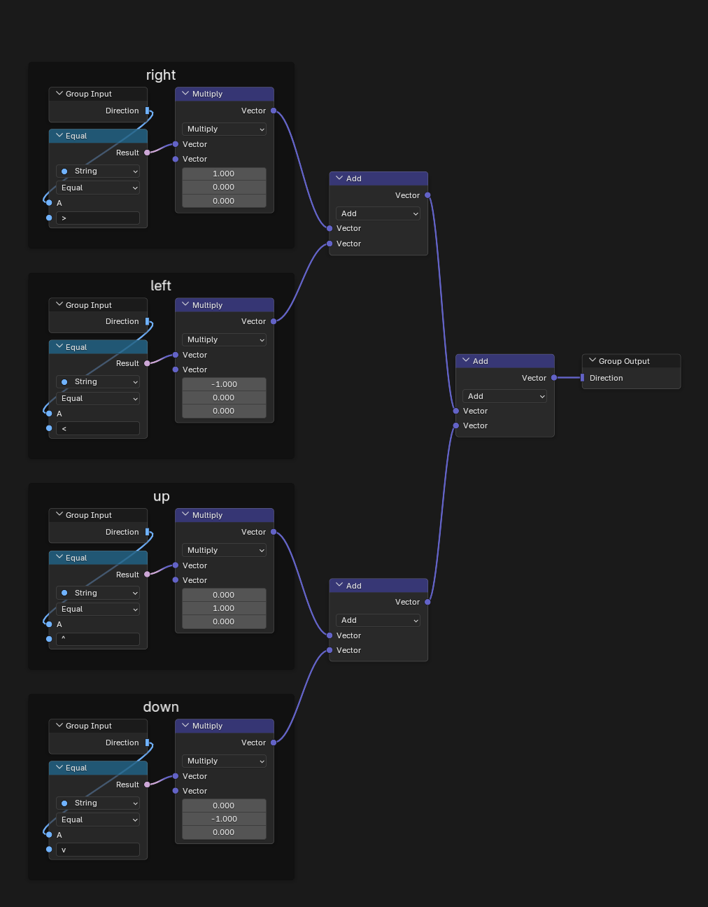
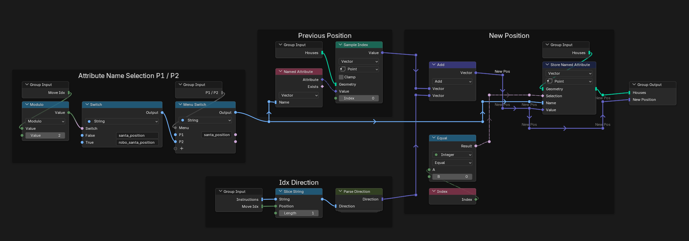
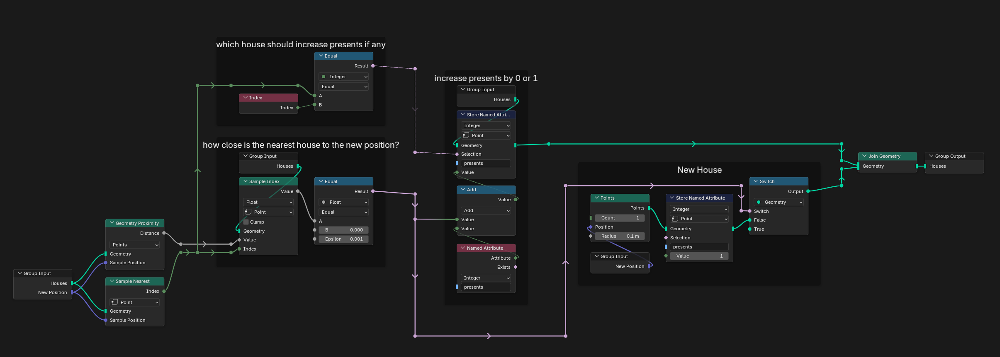
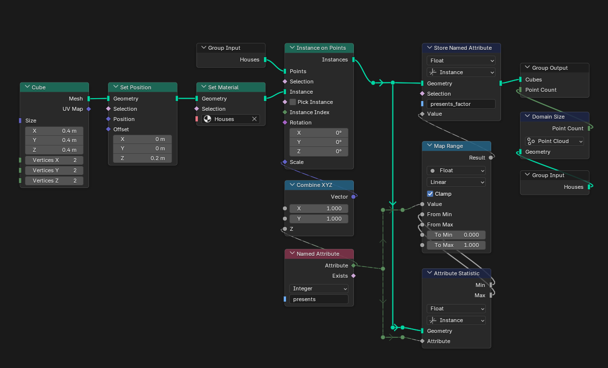
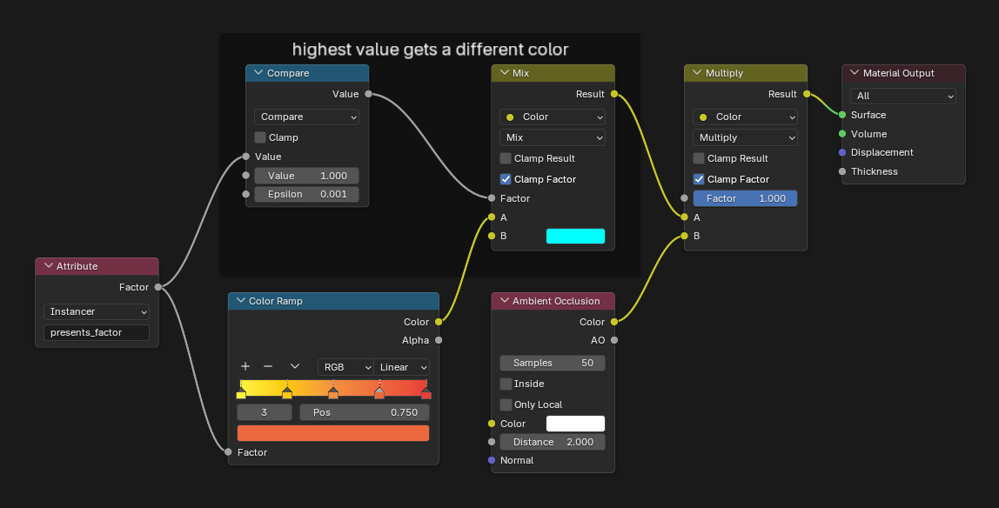
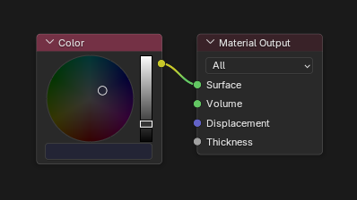

# Day 3: Perfectly Spherical Houses in a Vacuum

https://adventofcode.com/2015/day/3

**Part 1:** Santa moves one house north, south, east or west for each character of the input; count the houses that receive at least one present.

**Part 2:** Santa and Robo-Santa take turns following the same moves; count the houses that receive at least one present.

I used points to handle the logic. Point 0 is the starting house, at the world origin, and it also stores the positions of Santa and Robo-Santa, which change as each move is read. Every other point is a house.

The two parts cannot be shown at the same time, so there are three animations: part 1, part 2, and part 2 seen from above with an orthographic camera.

  
  
  

## Notes

- Choose the part with the "P1 / P2" menu in the modifier. The answer is the point count in the Viewer.
- To play the animation, press Bake in the Bake node first; otherwise it runs slowly.
- The camera may need some adjustment depending on which part is shown.
- The puzzle never asks which house gets the most presents. The visualization shows it anyway, as the tallest bar with a different color, because it looks nice.

## Solution

The main tree starts from a single point at the origin and runs a repeat zone over the input, one move per iteration. The Factor input sets how much of the input is processed, which drives the animation.

Parse Direction turns `>`, `<`, `^` and `v` into a step on the grid.

Process Direction picks who moves (always Santa in part 1, Santa and Robo-Santa in turns in part 2), adds the step to that position and stores it back on point 0.

Process Presents looks for a house at the new position: if there is one, it gets one more present; if not, a new point is added.

## Visualization

Points to Cubes places a cube on every house, scaled and colored by its number of presents.

## Materials

### Houses

### Ground

