# MD5 in Geometry Nodes

Part of [Day 4](README.md).

An implementation of MD5 in Geometry Nodes, following [RFC 1321](https://www.rfc-editor.org/rfc/rfc1321). The `MD5` node group takes a string and returns its digest as 32 hexadecimal characters.

To reuse it, append the `MD5` node group from `aoc-2015-04.blend` (File > Append > NodeTree); its sub-groups come with it.

Limits, enough for this puzzle:

- One 512-bit block only, so messages of up to 55 characters.
- Digits and lowercase letters only. Ord shows an error for any other character.

Bits are handled as strings of `0` and `1`, and 32-bit words as integers, with the bitwise nodes doing the rest.

## Overview

The steps of RFC 1321, from left to right: convert the message to bits, pad it, append its length, split it into words, run the 64 operations and write the result as hex.

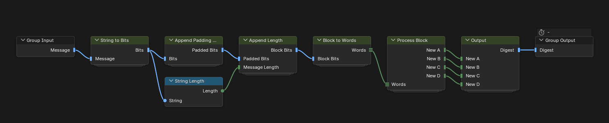

## 1. Message to bits

String to Bits turns every character into 8 bits.

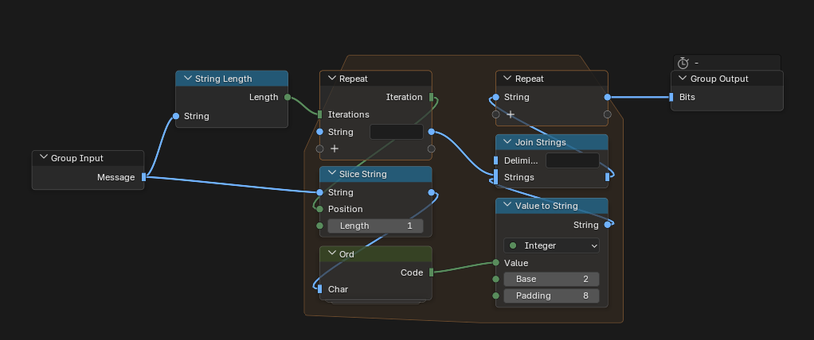

Ord returns the character code of a digit or a lowercase letter.

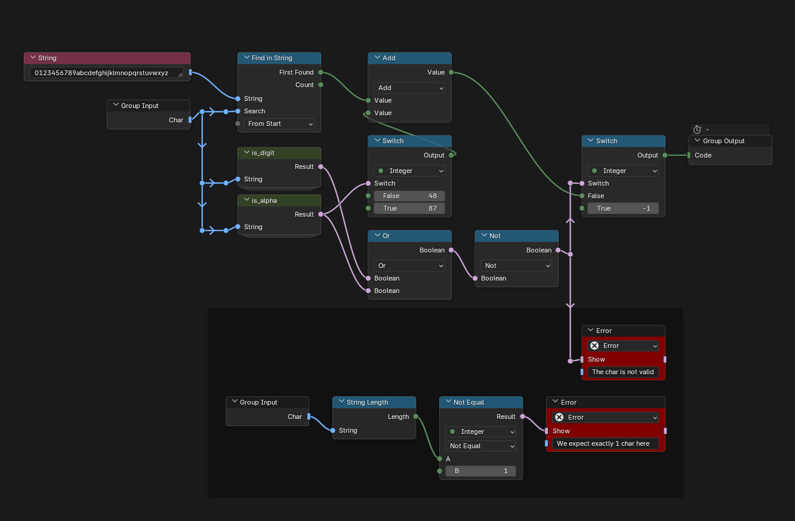

is_digit and is_alpha tell which kind of character it is.

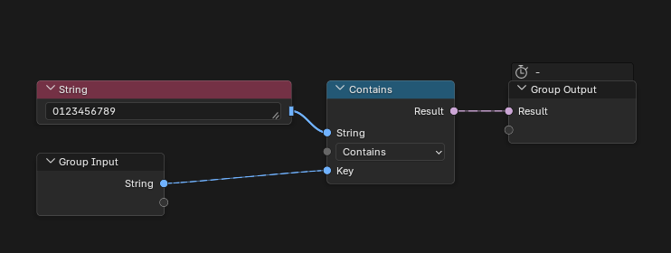

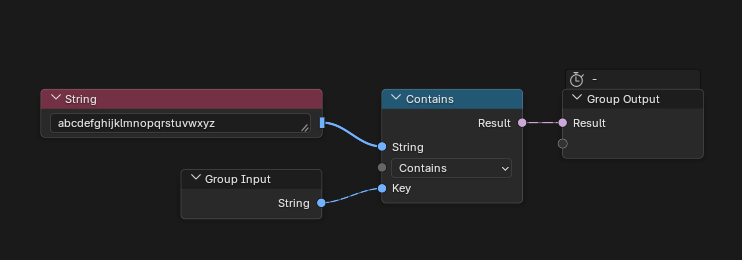

## 2. Padding and length

Append Padding Bits adds a `1` and then zeros up to 448 bits.

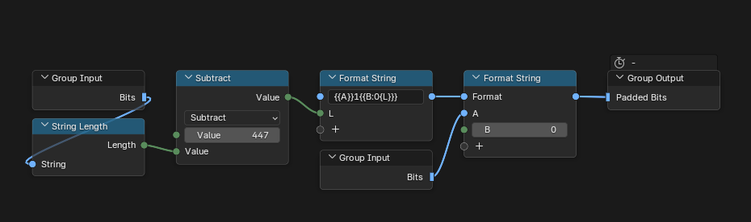

Append Length adds the message length in bits as 64 bits, low-order byte first.

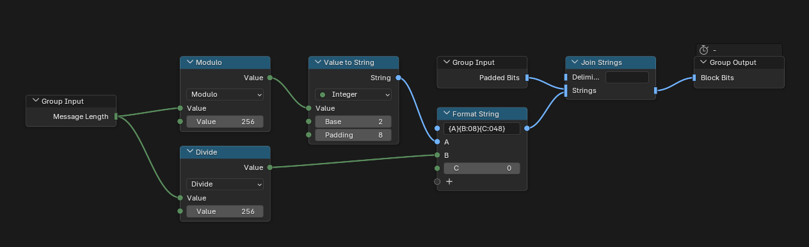

## 3. Words

Block to Words splits the 512 bits into 16 words of 32 bits.

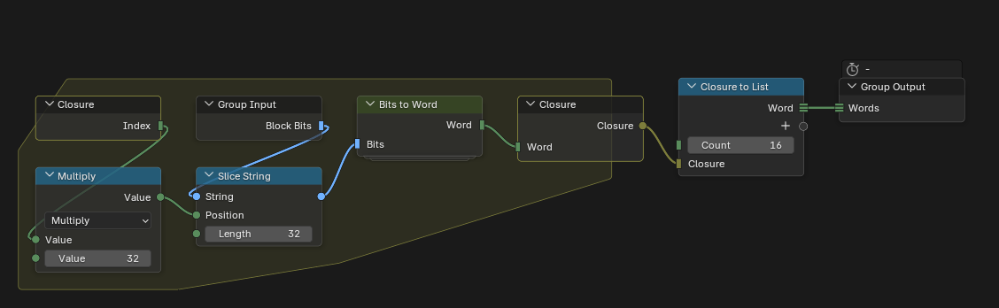

Bits to Word reads 32 bits as a word, low-order byte first.

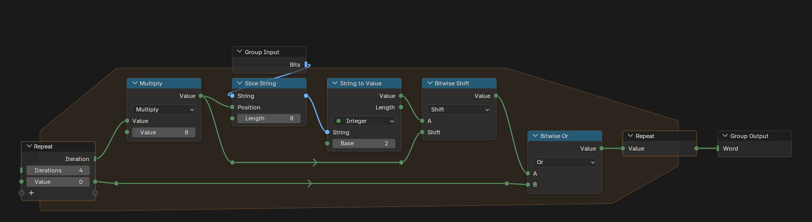

## 4. Buffer

Initialize MD Buffer sets A, B, C and D to the four starting values of RFC 1321.

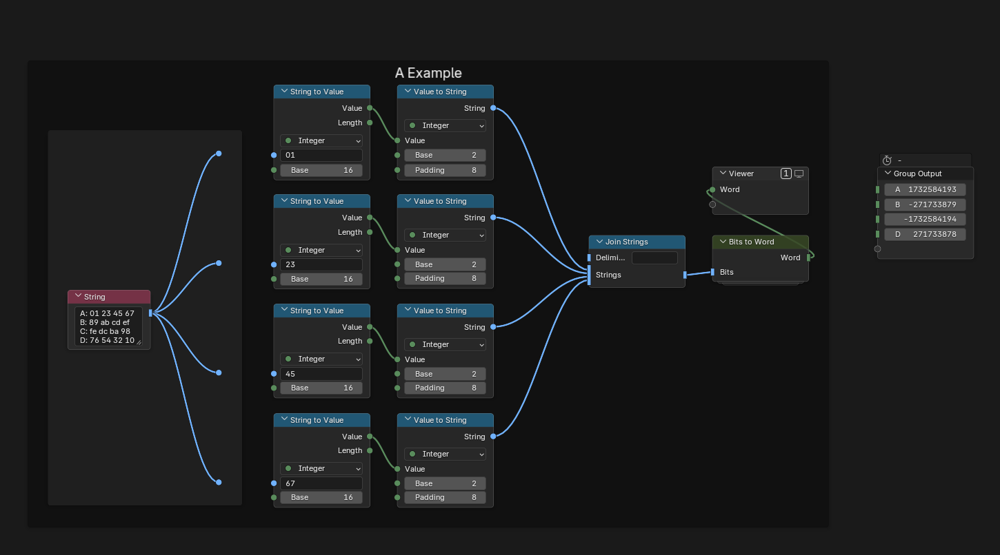

## 5. The 64 operations

Process Block runs the 64 operations in a repeat zone and adds the starting buffer to the result.

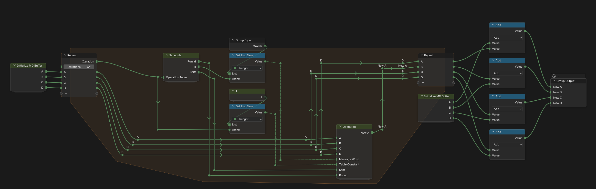

Schedule gives, for each operation, its round, which word of the message to use and how far to rotate.

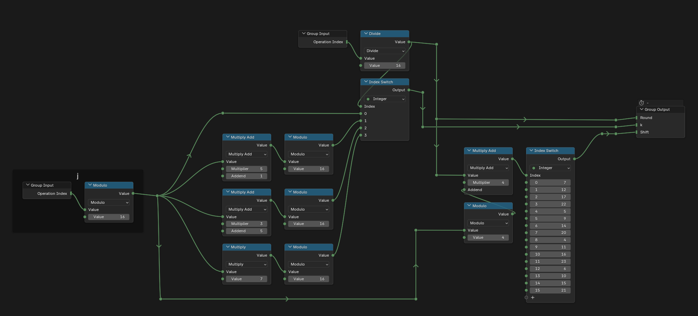

T holds the 64 constants, `floor(2^32 * |sin(i)|)`, hard-coded.

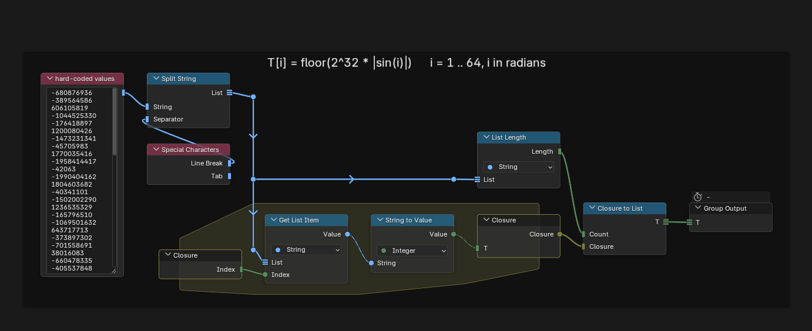

Operation picks F, G, H or I by round, adds the result, the message word and the constant to A, rotates it and adds B.

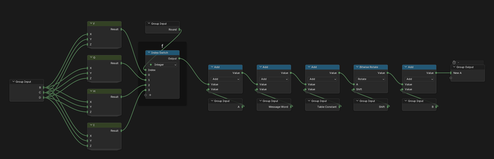

F, G, H and I are the four bitwise functions of the rounds.

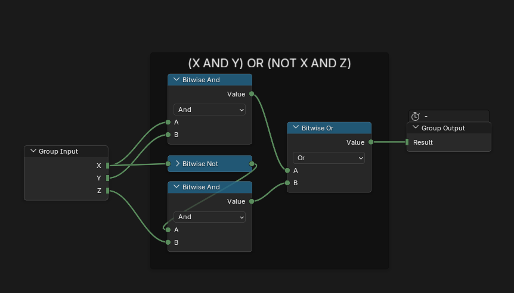

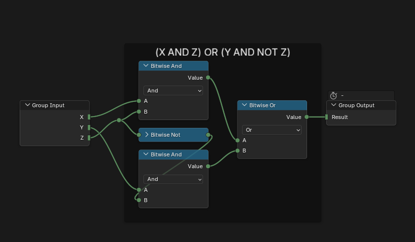

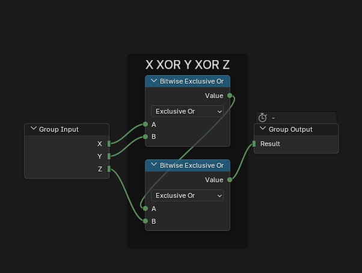

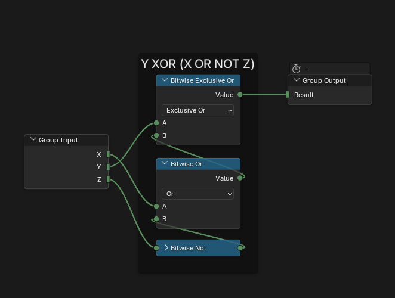

## 6. Output

Output writes A, B, C and D as hex and joins them into the digest.

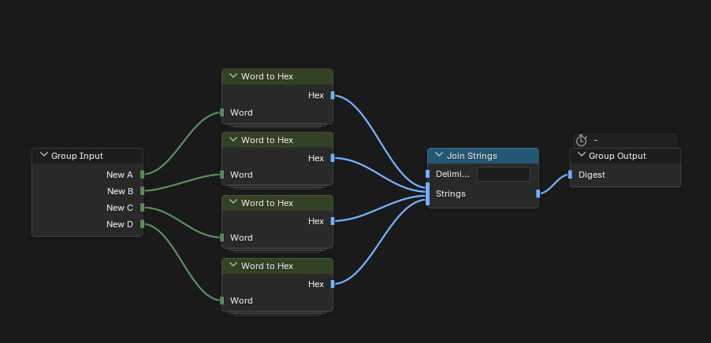

Word to Hex writes a word as 8 hex characters, low-order byte first.

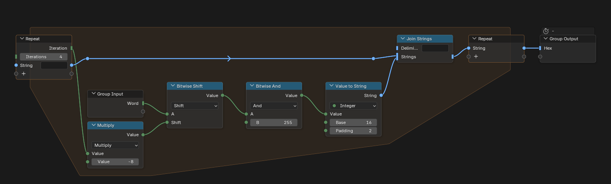
