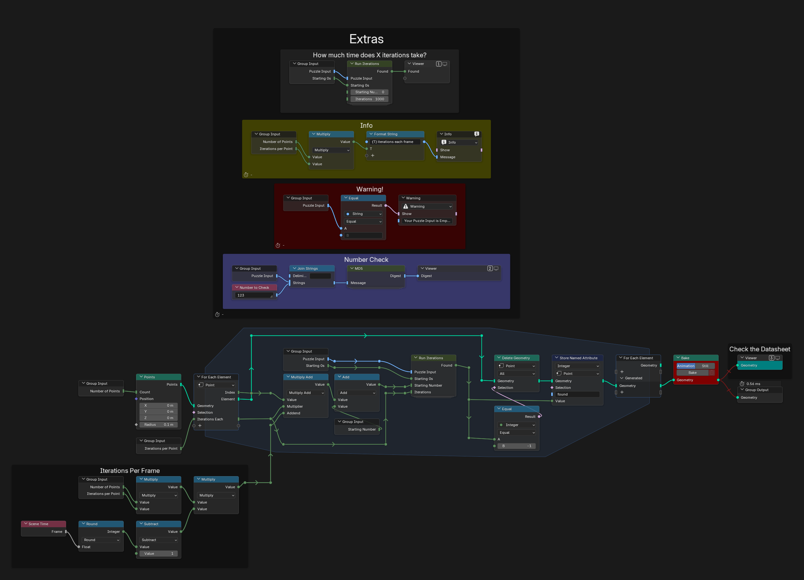
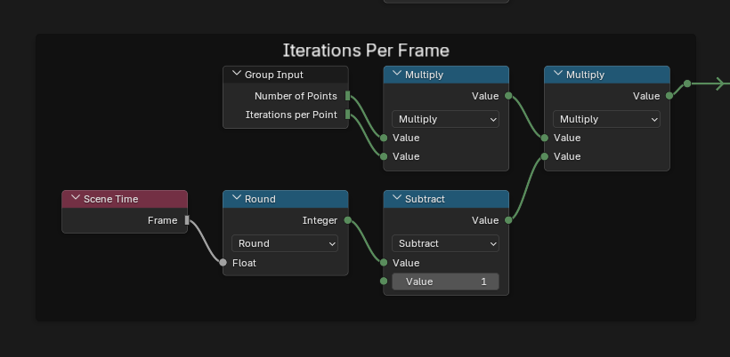
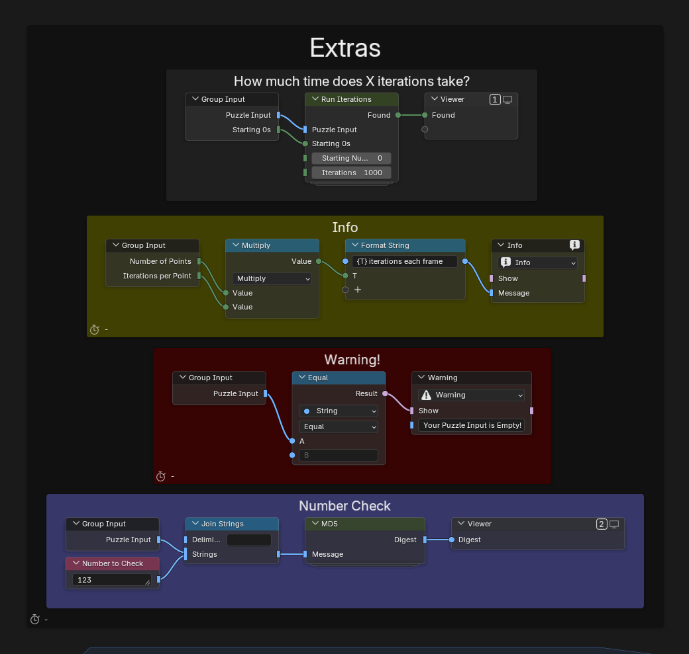
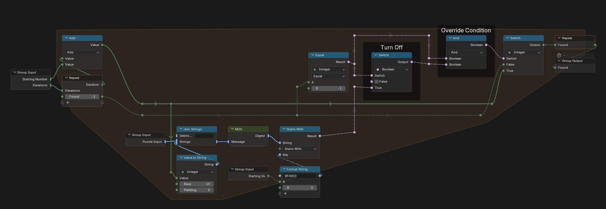

# Day 4: The Ideal Stocking Stuffer

https://adventofcode.com/2015/day/4

**Part 1:** find the lowest positive number that, appended to the secret key, gives an MD5 hash whose hexadecimal form starts with five zeros.

**Part 2:** the same, with six zeros.

There is no visualization for this day. Getting it to work was complex enough, and I could not think of a simple one; there is an idea at the end of this page. The whole puzzle revolves around MD5, so the MD5 node is the only picture this day has.

  

This puzzle is brute force: compute MD5 a huge number of times. Geometry Nodes has no MD5 library, so the first challenge was to implement it, following RFC 1321 with Claude as a guide. It is not complex, just a series of steps and many bitwise operations. The implementation has its own page, [MD5.md](MD5.md). To use it in your own file, append the `MD5` node group from this `.blend` and adapt it if needed.

Then the search. Geometry Nodes has no while loop, but a repeat zone runs a set number of times, like a for loop. That was enough for part 1, but part 2 stalled, so I split the work with a For Each Element zone, which Blender runs in parallel: every point checks its own batch of numbers. To split it further, each frame checks a different range. In the final setup, 1000 points run 100 iterations each, 100,000 numbers per frame, which takes about 12 to 15 seconds per frame on my PC. I ran 100 frames to be safe; with my input the answer appeared in frame 11.

## Notes

- Paste your input into the "Puzzle Input" field of the modifier (a short key, so no String node this time). "Starting 0s" is 5 for part 1 and 6 for part 2.
- Bake before anything else. While the tree is connected to the Viewer or the Group Output, every change recomputes, which takes about 12 seconds with the default numbers. Press Bake in the Bake node, and bake again after any change.
- Then step through the frames with the Viewer and the Spreadsheet. A frame that still has a point found a match, and its `found` attribute is the answer. The file's frame range is 1 to 15; extend it if your answer is larger.
- The Extras frame has checks to use before submitting an answer: a warning when the input is empty, the number of iterations per frame, a timing test for a given number of iterations, and Number Check, which shows the MD5 digest of the input followed by any number.

## Solution

The main tree creates one point per batch and runs a For Each Element zone over them. Each point checks "Iterations per Point" numbers from its own starting offset. Points without a match are deleted, the match is stored in the `found` attribute, and the result is baked.

### Iterations Per Frame

Each frame continues where the previous one stopped: the offset is the number of frames before the current one times the numbers checked per frame.

### Extras

### Run Iterations

The for loop: a repeat zone that appends each number to the input, hashes it and checks whether the digest starts with the required zeros. It keeps the first match, or -1 if there is none.

### MD5

All the MD5 groups are described in [MD5.md](MD5.md).

## Visualization idea

An animation of about 600 frames, with far fewer iterations per frame now that the answer is known, could show the moment the digest first starts with one zero, then two, and so on up to six. It is not simple to make: each frame checks a whole batch at once, and Geometry Nodes cannot measure how long a tree takes to compute. Scene Time only gives the frame and the seconds, and the timings overlay depends on the hardware.
