# Day 5: Doesn't He Have Intern-Elves For This?

https://adventofcode.com/2015/day/5

**Part 1:** count the strings in the input that pass three rules: enough vowels, a letter that appears twice in a row, and none of a few forbidden pairs.

**Part 2:** count them again with two different rules: a pair of letters that appears twice without overlapping, and a letter that repeats with exactly one letter between.

There are two files. `aoc-2015-05.blend` only computes the answers. `aoc-2015-05-viz.blend` is the visualization, and it shows the answers too: the strings scroll past as text, each one turning green when it is nice or red when it is not, while a counter adds up the nice ones.

  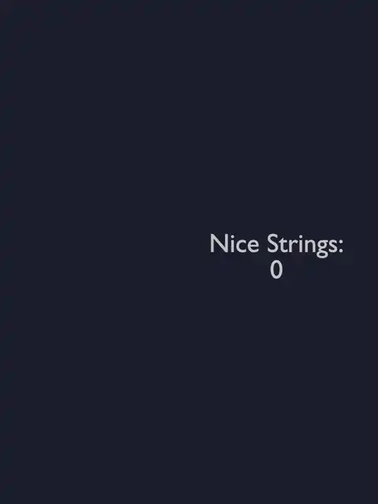 
  <em>Part 1</em>

   
  <em>Part 2</em>

## Notes

- In both files, paste the input into the "Puzzle Input" node. In `aoc-2015-05.blend` the answers are in the Viewer.
- In `aoc-2015-05-viz.blend`, choose the part with the "Part" menu in the modifier, and press Bake in the "Bake Still" frame after changing the input.

## Solution

The main tree of `aoc-2015-05.blend` splits the input into lines and checks each one with both sets of rules in a repeat zone, counting the nice strings of each part.

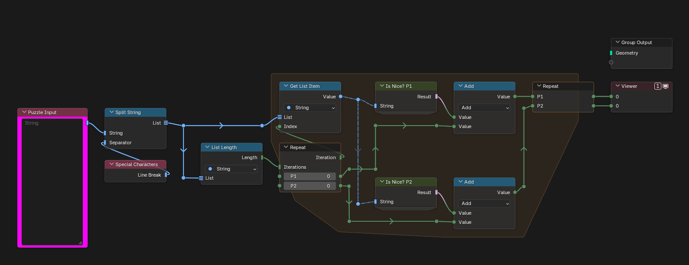

Is Nice? P1 combines the three rules of part 1.

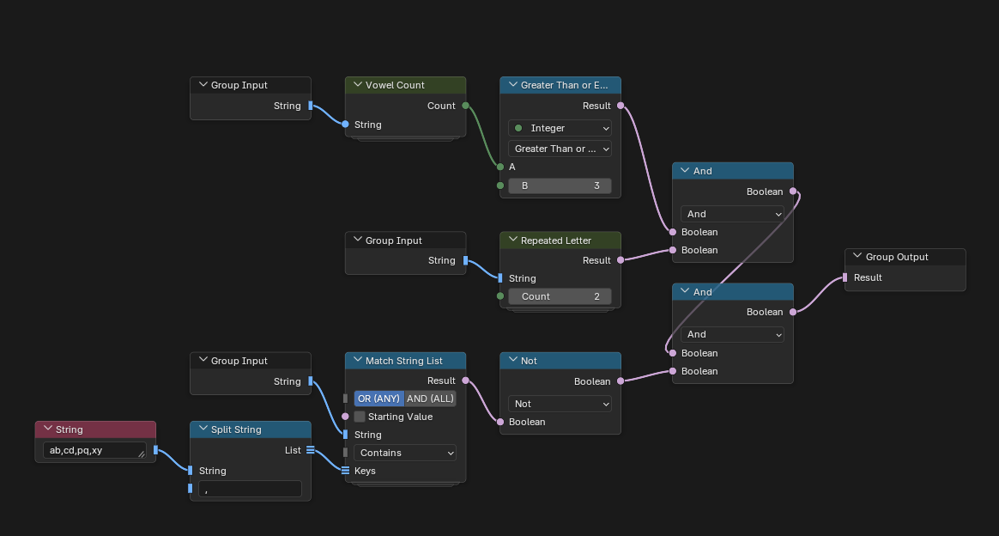

Vowel Count counts the vowels of a string.

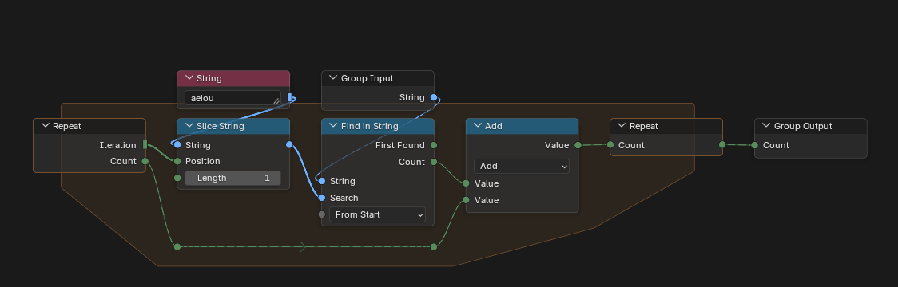

Repeated Letter checks whether any letter appears a given number of times in a row. It builds the run of letters with two Format String nodes: the first writes a format such as `{C:a>2}`, and the second applies it to an empty string.

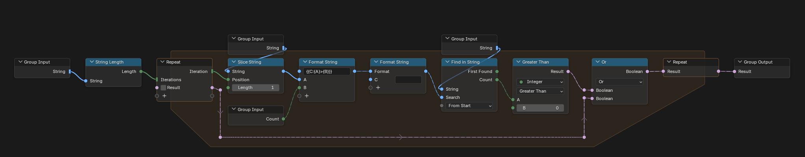

Match String List checks a string against a list of keys, with a choice of operation and of combining them with OR or AND. Part 1 uses it for the forbidden pairs.

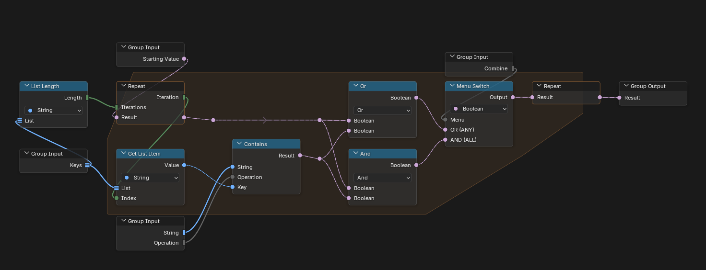

Is Nice? P2 combines the two rules of part 2.

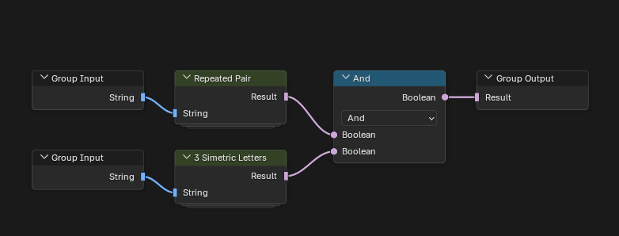

Repeated Pair looks for a pair of letters that appears at least twice.

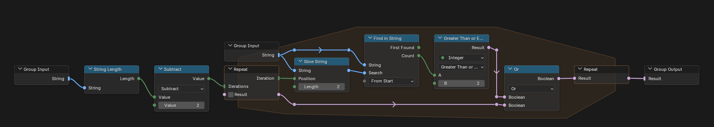

3 Simetric Letters looks for three letters in a row whose first and last are the same.

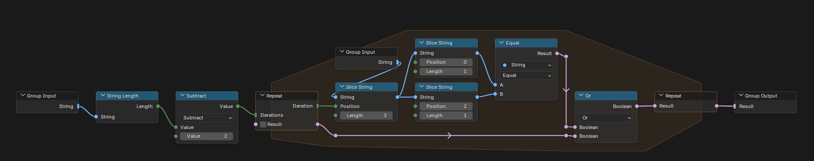

## Visualization

The main tree of `aoc-2015-05-viz.blend` uses the same groups.

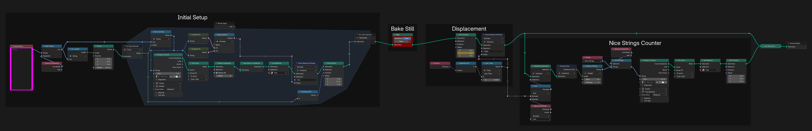

### Initial Setup

Turns every string into text, one line per string, and stores whether it is nice for the chosen part.

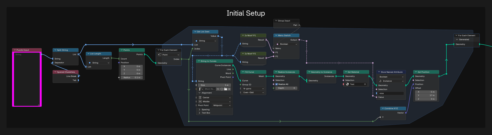

### Bake Still

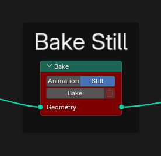

### Displacement

Scrolls the text over time and marks each string as ready once it passes the middle, which gives it its color.

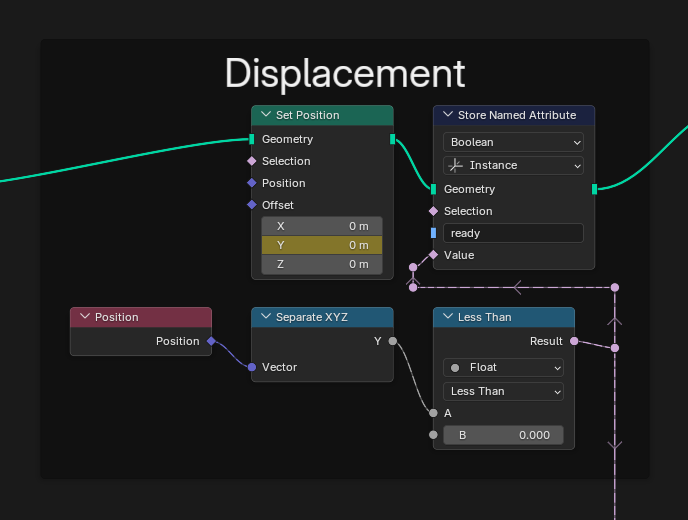

### Nice Strings Counter

Counts the nice strings that are already marked as ready and writes the total.

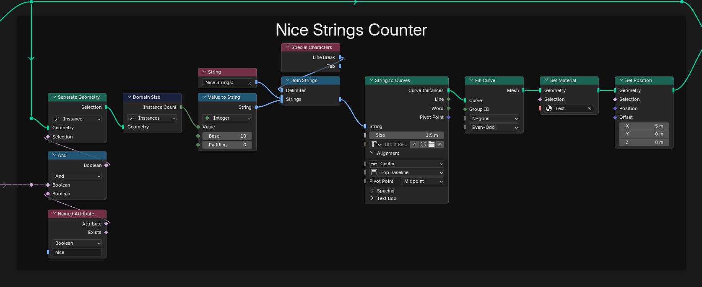

## Materials

### Text

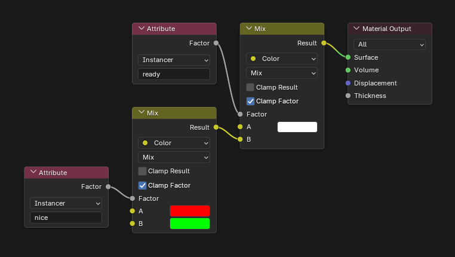

## Compositor

