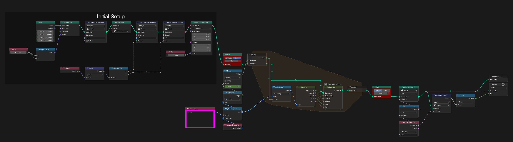
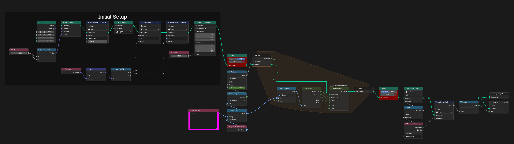
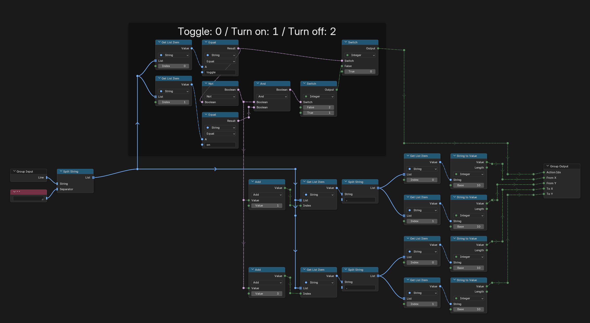
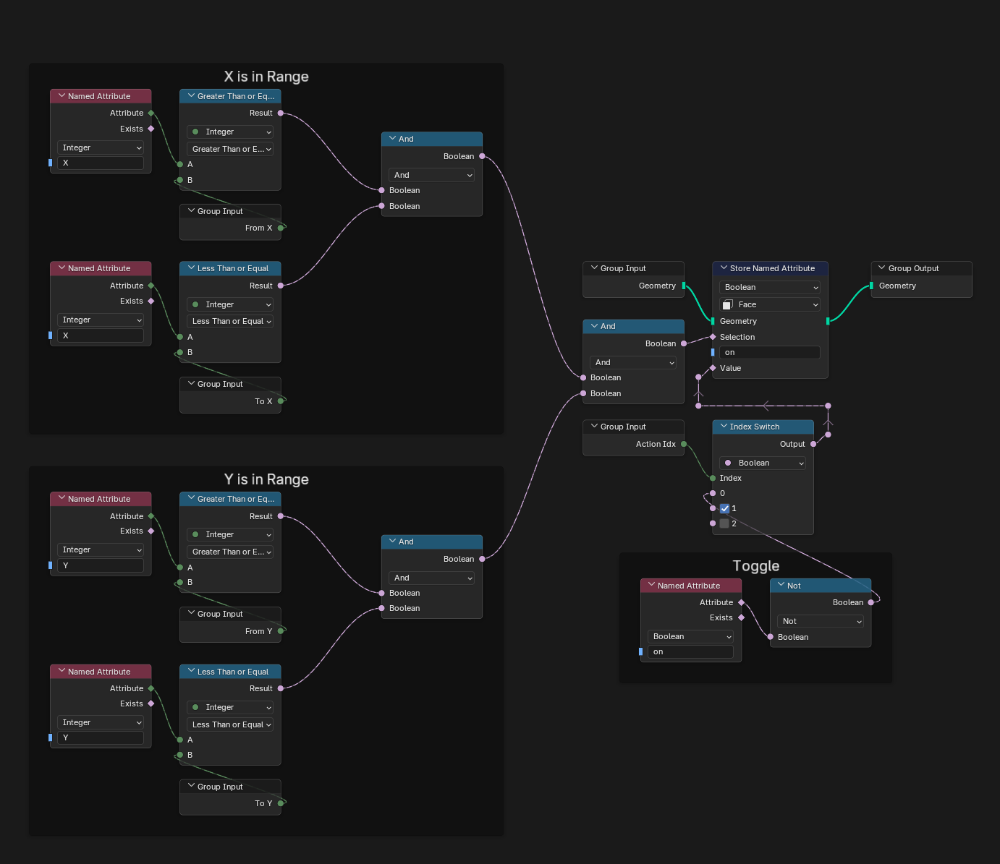
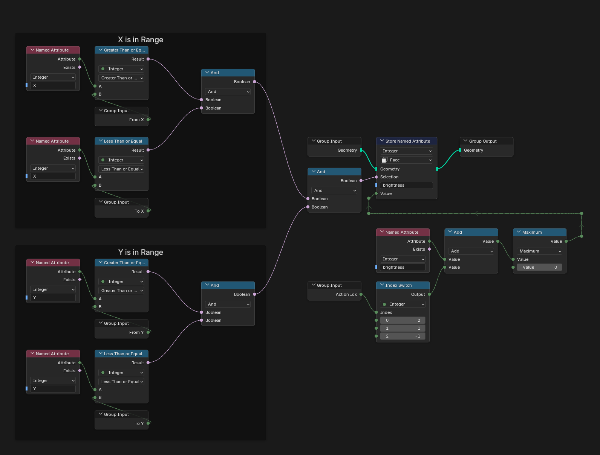
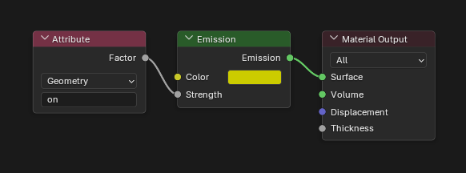
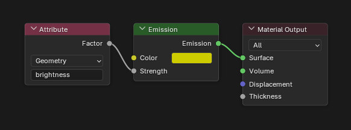
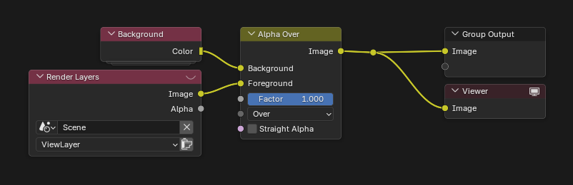

# Day 6: Probably a Fire Hazard

https://adventofcode.com/2015/day/6

**Part 1:** a 1000 by 1000 grid of lights follows a list of instructions that turn on, turn off or toggle rectangles of lights; count the lights that end up on.

**Part 2:** each light has a brightness instead: turning on adds 1, turning off removes 1 (never below 0) and toggling adds 2; add up the total brightness.

Each part has its own visualization, on its own object: "Day 6 - Part 1" and "Day 6 - Part 2". Every light is a face of a grid, lit by its state in part 1 and by its brightness in part 2.

   
  <em>Part 1</em>

   
  <em>Part 2</em>

## Notes

- Show the object of the part you want and hide the other one. Paste the input into the "Puzzle Input" node of that object's tree.
- The answer is in the Viewer: the number of lights on for part 1, the total brightness for part 2.
- Each tree has Bake nodes; bake them before playing the animation.

## Solution

Each part has its own main tree. It builds the grid, stores the position of every light, then runs a repeat zone over the instructions, one per iteration. At the end, the lights that are off are removed and the result is added up.

Parse Line reads an instruction: the action (toggle, turn on or turn off) and the two corners of the rectangle.

Apply Action P1 turns the lights inside the rectangle on or off, or toggles them.

Apply Action P2 changes the brightness of the lights inside the rectangle, never going below 0.

## Materials

### Lights P1

### Lights P2

## Compositor

